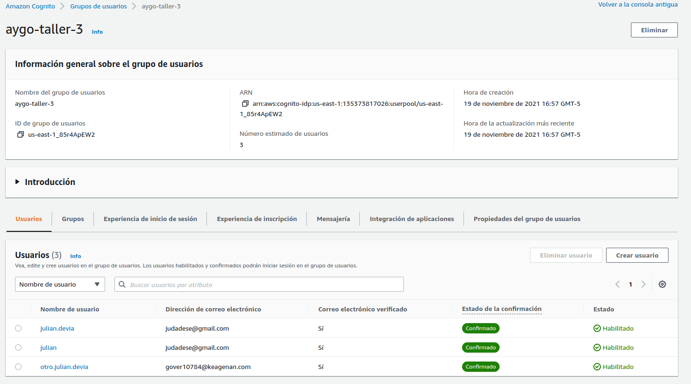
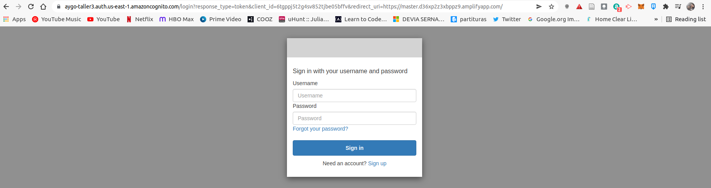

# Taller 3 AYGO

## Taller seguridad

Para ejemplificar la implementación de un servidor https y un cliente que pueda acceder al contenido que este expone se utilizó un servidor hecho en spark sobre la JVM en lenguaje Kotlin [web server](taller_seguridad/src/main/java/co/edu/escuelaing/security/HelloService.kt), un cliente HTTP usando los paquetes base de Java [cliente http](taller_seguridad/src/main/java/co/edu/escuelaing/security/SecureUrlReader.kt) y keytool para generar las llaves que se utilizarán para asegurar el contenido.

En esta imagen se puede ver que si el servidor está usando autenticación segura por medio de un par de llaves y el cliente no está usando esta configuración para accceder, sino un cliente http normal, no podrá acceder al recurso, pero si podrá acceder a otros expuestops a internet como por ejemplo google.

Y acá se ve que si se tienen los certificados correctamente configurados en el cliente si podrá acceder al recurso en el servidor local, pero no a google, pues éste no reconoce los certificados con los que se está intentando acceder.

## Taller serverless

Se desarrolló la implementación de una a rquitectura serverless usando los servicios amplify, cognito, api gateway, lambda y dynamodb de aws.

Primero se configura aws amplify para que tome los cambios de un repositorio de código, en este caso, se utiliza este mismo repositorio de github. Con esta configuración amplify asigna un dominio y se encarga de hacer el build necesario del frontend y de desplegarlo cada que haya algún cambio en la rama configurada, así se ve el proyecto ya confiurado en amplify.

Luego se debe crear un grupo de usuarios en cognito, configurar nuestra aplicación para hacer uso de tokens y asignar la url a la que va a redirigir cognito luego de realizar el inicio de sesión.

Ahora se necesita uan base de datos para almacenar la información que vamos a manejar en la aplicación, en este caso se va a usar DynamoDB, para esto solo es necesario crear la tabla de DynamoDB en aws.

Para manejar los requests de almacenar y consultar la información se implementarán funciones lambdas que reciban los requests http, en este caso tenemos la función [aygo-taller3](lambdas/get_all_posts.py) que se encarga de leer toda la tabla de dynamo y entregar el resultado, y la función [aygo-taller3-crear](lambdas/create_post.py) que se encarga de guardar la información que recibe en la tabla de dynamo, y el nombre del usuario que la envía junto con ella.

Ahora se usará el servicio Api gateway para recibir los requests http y redirigirlos a las lambdas utilizando cognito para autenticar el contenido de éstos.

Acá se ven las rutas y métodos definidos para este caso de uso.

Y acá se puede ver el ejemplo de un flujo, en el que se recibe el request http, se autentica con cognito, se entrega a la función lambda y el resultado de esta se entrega al cliente que realizó la solicitud.

Ahora la aplicación que se desplegó utilizando esta arquitectura se ve de la siguiente forma:

- Pantalla principal que redirige al login

- Pantalla de login de aws cognito

- Pantalla de creación de cuenta

- Pantalla de verificación por código de correo electrónico

- Ver los posts creados

- Ver los posts actualizados automáticamente luego de crear unos nuevos

